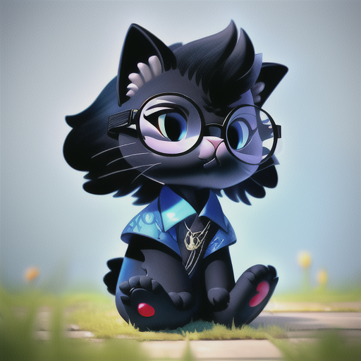

  

<h2 align="center">👋 Welcome to my GitHub Profile! 👋</h2>

  

  

## 🔧 Technologies & Tools

    
    
    
    

## 📈 GitHub Stats

  
  

  

## 🐱 Meet My Cats 🐱

  <table>
    <tr>
      <td>
        
        <h3 align="center">Michael</h3>
        
The curious explorer who loves climbing and playing with toys

      </td>
      <td>
        
        <h3 align="center">Lily</h3>
        
The gentle soul who enjoys napping in sunbeams and gentle pets

      </td>
    </tr>
  </table>

## 🌱 Currently Learning

- Advanced Java patterns
- Cloud-native architecture
- Al tools
- Functional programming concepts

## 💡 Fun Facts

- 🧩 I enjoy solving algorithmic puzzles
- 🎮 Gaming enthusiast
- 📚 Avid reader of technical books
- 🏃‍♂️ Fitness and outdoor activities lover

## 📫 How to Reach Me

  

  

